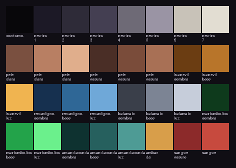

# AMANDACONDA — Especificação de arte

Você desenha, o jogo carrega. Este documento existe para que essas duas coisas se encontrem
sem retrabalho.

A tabela de tamanhos e a lista de animações não são texto: vivem em
[`data/sprites.json`](../data/sprites.json), e é de lá que o validador e o jogo leem. O que
está escrito aqui explica **por quê**.

## As três coisas que quebram o jogo em silêncio

1. **Tamanho fora do combinado.** O código fatia a folha em quadros iguais. Um pixel a mais na
   largura e todos os quadros saem tortos.
2. **Cor fora da paleta.** Uma cor sozinha não estraga nada visualmente, mas quando cada sprite
   traz as suas, o jogo perde a unidade e parece feito de pedaços.
3. **Anti-aliasing.** Borda suavizada gera pixels meio transparentes. Ampliados 4 vezes, viram
   uma franja cinza em volta do personagem.

Nenhuma das três dá erro ao rodar. Por isso existe o validador, no fim deste documento.

## Você não precisa saber desenhar

Existem duas rotas. As duas terminam no mesmo lugar, porque o validador e o ajustador não se
importam de onde o pixel veio.

**Rota A — gerar com IA.** [PixelLab](https://www.pixellab.ai/) é feita só para pixel art de
jogo: você descreve o personagem, ela gera o sprite, e depois anima ele a partir de uma imagem
de referência com animação por texto ou por esqueleto. É isso que resolve o problema que um
gerador de imagem comum não resolve — manter o **mesmo** personagem entre os quadros.

Ela roda no navegador, no editor gratuito Pixelorama, ou como extensão do Aseprite. Só a
extensão exige o Aseprite pago; as outras não exigem nada.

O teto de 200x200 pixels da conta gratuita cabe folgado: o maior canvas do jogo é o da
Amandaconda, 160x96.

**Rota B — desenhar no Aseprite.** Mais trabalho, controle total. As instruções abaixo.

De qualquer jeito, arte que vem de fora quase nunca sai no tamanho certo nem na paleta certa.
Para isso existe o ajustador, no fim deste documento.

## Aseprite, configuração inicial

1. `File > New`: largura e altura conforme a tabela, **Color Mode: Indexed**, **Background:
   Transparent**
2. `Palette > Load Palette` e escolha [`docs/arte/paleta.gpl`](arte/paleta.gpl)
3. Na barra de ferramentas, com o lápis selecionado, confirme que **Anti-aliasing está
   desligado** (é o padrão do lápis, mas não do pincel)
4. Ao exportar: `File > Export Sprite Sheet`, tipo **Horizontal Strip**, sem espaçamento, sem
   borda, sem "Trim"

O modo Indexed é o que garante o item 2 sozinho: com a paleta carregada, o Aseprite não deixa
você escolher uma cor que não existe nela.

## A paleta



32 cores. Oito neutros para contorno, roupa e cenário; duas rampas de pele; uma rampa de três
tons para cada chefe, na cor de assinatura dele; âmbar de interface; e dois vermelhos de dano.

Cada chefe usa **os neutros mais a rampa dele**. É isso que faz cinco lutas parecerem cinco
lugares diferentes sem custar arte nova de cenário.

## Âncora e direção

Duas convenções, e o código não precisa de nenhum ajuste por sprite:

**A base do canvas é o chão.** Os pés encostam na última linha de pixels. O corpo fica centrado
na largura. Todo o resto do canvas é sobra para o golpe passar.

**Todo mundo é desenhado virado para a direita.** O código espelha quando anda para a esquerda.
Desenhar os dois lados dobraria o trabalho para ganhar nada.

No jogador, por exemplo: canvas de 64x48, corpo de 18x40 no meio. Sobram 23 pixels de cada lado
e 8 acima da cabeça. Esses 23 pixels são o alcance do seu ataque leve.

## Tamanhos

| Entidade | Canvas | Corpo | Por quê |
|---|---|---|---|
| Jogador | 64x48 | 18x40 | Sobra para o golpe dos dois lados |
| Chatana | 32x32 | 16x16 | Pequena e irritante |
| Portara | 48x56 | 28x48 | Larga, é um muro |
| Net | 32x48 | 14x36 | Fina e alta, é uma antena |
| LuanEvil | 96x64 | 34x46 | Corpo largo, headphone no pescoço sempre |
| Renanligno | 80x64 | 20x48 | Magro e alto |
| Balarrals | 64x48 | 18x40 | Igual ao jogador, de propósito |
| Marlombólico | 80x56 | 20x42 | Magro, de chinelo, uma mão no bolso |
| Amandaconda | 160x96 | 30x64 | Canvas largo por causa da cauda |

O corpo é a caixa de colisão, não o desenho. O desenho pode passar dela à vontade — cabelo,
arma, cauda. Só os pés e a largura do tronco precisam bater.

## O truque do Balarrals

Ele é o espelho: usa o seu moveset. Então ele **não tem folha própria**. Copie a folha do
jogador, troque a rampa de cor pela dele e inverta a arma de mão.

Um chefe inteiro pelo preço de um retint. Não é preguiça, é a mecânica dele virando economia —
e o jogador reconhecer os próprios golpes vindo contra ele é exatamente o efeito que a luta
quer.

## Quantos quadros ao todo

**129 quadros originais**, mais 24 recolorações para o Balarrals. Espalhado por oito semanas dá
umas 16 por semana, mas não desenhe nessa ordem.

## O que desenhar primeiro

Desenhe **30 quadros** e o jogo inteiro já está provado:

| Ordem | O quê | Quadros |
|---|---|---|
| 1 | Jogador: parado, andando, no ar, rolando, ataque leve | 15 |
| 2 | LuanEvil: parado, andando, investida, pisada, dano | 15 |

Com isso você tem um personagem que se move e um chefe que reage. Todo o resto é repetição de
um problema que você já resolveu. Se o prazo apertar, é aqui que você sabe que a fase 1 se
sustenta.

Depois, nesta ordem: o resto do jogador → Amandaconda → Renanligno → Marlombólico → inimigos
comuns → Balarrals (que é só retint). Os inimigos comuns vêm quase no fim de propósito: são os
que menos aparecem em tela por tempo.

**Não desenhe nada disso antes da semana 5.** Até lá o retângulo com um olho é a escolha certa.
Trocar arte antes do combate existir é o jeito mais rápido de chegar na semana 8 com um jogo
bonito que não é jogável.

## Conferir o que você desenhou

Salve em `assets/sprites/<entidade>/<animação>.png` e rode:

```bash
.venv\Scripts\python.exe tools\sprites.py validar
```

Ele confere tamanho, paleta e anti-aliasing em tudo que já existe, e diz quantos quadros faltam.
Para conferir um só:

```bash
.venv\Scripts\python.exe tools\sprites.py validar player parado
```

Se você mexer na paleta, `tools\sprites.py paleta` regenera a amostra acima a partir do `.gpl`
— a imagem nunca fica desatualizada em relação ao arquivo que o Aseprite carrega.

## Encaixar arte que veio de fora

Gerador de IA, pacote gratuito, outro programa: nada disso sai no tamanho e na paleta deste
jogo. O ajustador faz a conversão:

```bash
.venv\Scripts\python.exe tools\sprites.py ajustar entrada.png player andando
```

Ele reduz para o tamanho da especificação, recorta o fundo se a imagem vier sem transparência,
joga cada pixel na cor mais próxima da paleta, corta a transparência parcial e salva já no
caminho certo. Depois é só validar.

A redução usa média de área antes de encaixar na paleta. Reduzir por vizinho mais próximo
perderia traço fino; a média preserva como tom e o encaixe devolve para pixel art dura.

O recorte de fundo tem tolerância baixa de propósito. Neste jogo o contorno dos desenhos é
quase preto e o fundo também costuma ser, então uma tolerância generosa comeria o contorno
junto. Se o gerador tiver opção de fundo transparente, use — é sempre melhor que adivinhar.
